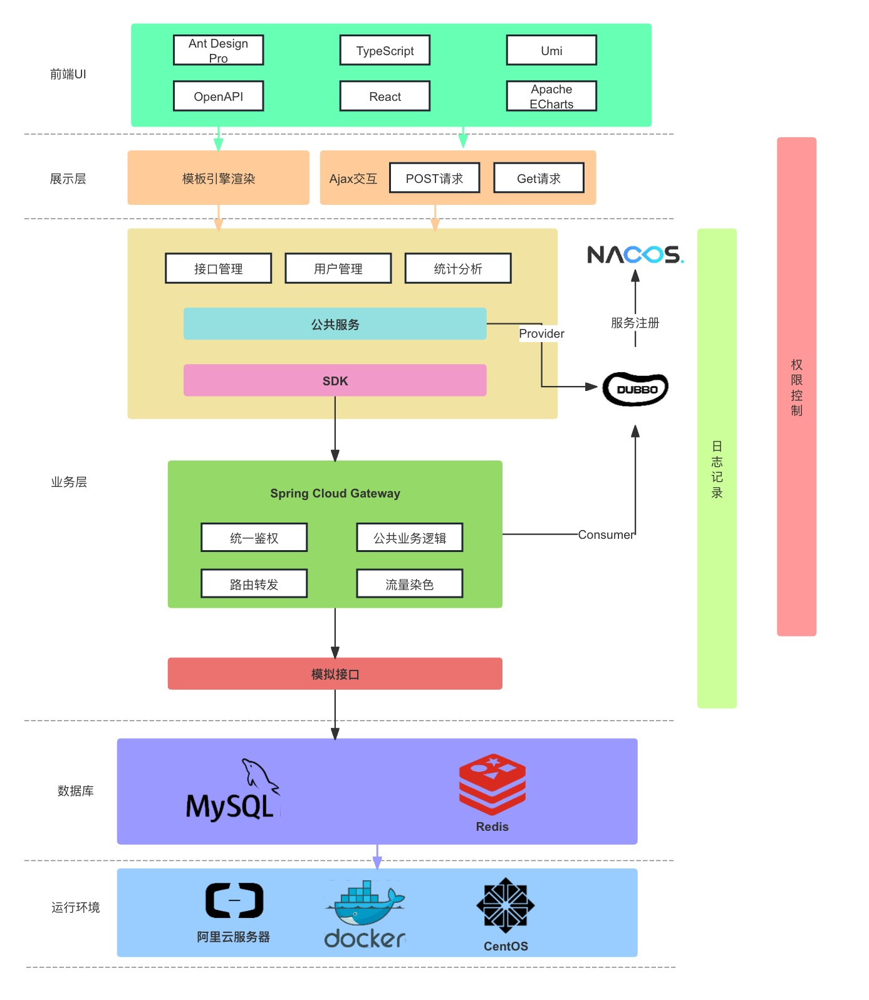

# 数字灯塔-API开放平台（后端）

基于 React + Spring Boot + Dubbo + Spring Cloud Gateway 的 API 接口调用平台

管理员可以接入并发布接口并且可视化的查看各接口的调用情况；用户可以通过平台浏览接口及在线调用，开发者可以通过封装的 SDK
轻松的调用接口

前端地址：[数字灯塔-API开放平台（前端）](https://github.com/null920/lightHouse-api-frontend)

## 架构图

## 技术栈

* Java
* Spring Boot
* Spring Boot Starter（SDK 开发）
* Spring Cloud Gateway 微服务网关
* Spring Scheduler
* MySQL
* MyBatis-Plus
* API 签名认证
* Dubbo (RPC)
* Nacos (注册中心)
* Swagger + Knife4j
* Redis
* Redisson
